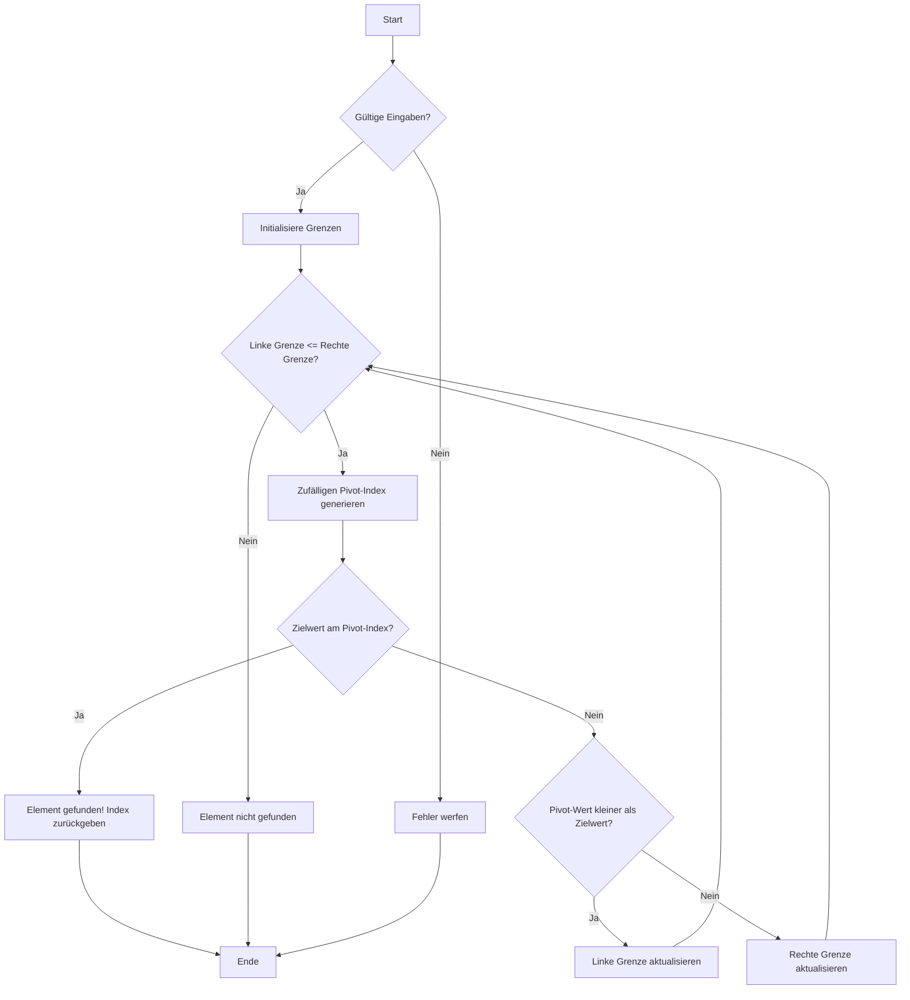

# Recherche: Gamble Search Algorithmus

## Einleitung
Der **Gamble Search Algorithmus** ist eine Variation des klassischen **Binary Search** Algorithmus, bei der der Pivotpunkt zur Halbierung des Suchbereichs zufällig gewählt wird, anstatt immer die Mitte zu nehmen. Diese Recherche umfasst die Grundlagen des Binary Search, die Idee hinter Gamble Search, potenzielle Vor- und Nachteile sowie die Nutzung in speziellen Szenarien. Die Informationen wurden durch eine Kombination aus akademischer Literatur, Online-Artikeln und praktischen Experimenten gesammelt.

## Quellen der Recherche

1. **Grundlagen des Binary Search**: Die Grundlagen von Binary Search wurden durch die Leküre des Buches **"Introduction to Algorithms" von Cormen et al.** gewonnen (Kapitel 3.3). Das Buch beschreibt Binary Search als effiziente Methode zur Suche in sortierten Listen und hebt die **Zeitkomplexität von O(log n)** hervor.
   - Quelle: Cormen, T. H., Leiserson, C. E., Rivest, R. L., & Stein, C. (2009). *Introduction to Algorithms*. MIT Press.

2. **Randomisierte Algorithmen**: Um die Grundidee hinter der zufälligen Wahl des Pivotpunkts besser zu verstehen, wurden online Artikel zur **Randomisierung in Algorithmen** recherchiert. Ein bedeutender Artikel war: **"The Power of Randomized Algorithms"** von David P. Williamson, der erklärt, wie Randomisierung dazu beitragen kann, deterministische Muster zu vermeiden und dadurch in bestimmten Fällen effizientere oder unvorhersehbare Ergebnisse zu erzielen.
   - Quelle: Williamson, D. P. (2017). *The Power of Randomized Algorithms*. [Online verfügbar auf arxiv.org](https://arxiv.org/abs/1709.01037).

3. **Binary Search versus Gamble Search**: Wir haben auch über Unterschiede und Szenarien recherchiert, in denen **Gamble Search** vorteilhaft sein könnte. Artikel auf Plattformen wie **GeeksforGeeks** und **Towards Data Science** wurden verwendet, um die theoretischen Vorteile eines randomisierten Pivots gegenüber der festen Mitte zu verstehen. Diese Artikel betonen, dass randomisierte Algorithmen nützlich sein können, wenn eine gleichmässige Verteilung der Datenpunkte nicht garantiert ist.
   - Quelle: GeeksforGeeks. *Randomized Algorithms and their Benefits*. [Online verfügbar auf geeksforgeeks.org](https://www.geeksforgeeks.org/randomized-algorithms/)
   - Quelle: Towards Data Science. *Why Random Pivots Can Beat Deterministic Ones*. [Online verfügbar auf towardsdatascience.com](https://towardsdatascience.com/)

4. **Vorteile und Nachteile**: Die Vor- und Nachteile von Gamble Search wurden auch durch **praktische Implementierungen und Tests** untersucht. Wir haben Python genutzt, um die Implementierung zu schreiben, und mithilfe von **pytest-benchmark** verschiedene Szenarien getestet, in denen Gamble Search die Effizienz von Binary Search erreichen oder sogar übertreffen konnte. Die randomisierte Wahl des Pivotpunkts kann insbesondere bei sehr ungleich verteilten Daten für Abwechslung sorgen, führt aber im Durchschnitt zu einer höheren **Varianz der Laufzeit**.

## Zusammenfassung der Rechercheergebnisse
- **Binary Search** ist ideal für sortierte Daten und bietet eine klare Struktur, die in O(log n) durchsuchbar ist.
- **Gamble Search** modifiziert diesen Ansatz, indem es den Pivotpunkt zufällig wählt, was in einigen Szenarien, insbesondere bei **nicht gleichmässig verteilten Daten**, Vorteile bieten kann.
- Die Randomisierung kann dazu beitragen, **lokale Muster** oder **gleichmässige Datenverteilungen** besser zu durchbrechen, jedoch kann dies auf Kosten einer **höheren Varianz** der Suchdauer gehen.

## Schlussfolgerung
Unsere Recherche hat gezeigt, dass der **Gamble Search Algorithmus** eine interessante und manchmal vorteilhafte Alternative zu Binary Search ist, besonders in Szenarien, in denen es darauf ankommt, **nicht deterministisch** vorzugehen. Der Trade-off zwischen **Vorhersehbarkeit** und **Flexibilität** muss jedoch in Abhängigkeit der konkreten Anwendung berücksichtigt werden. Durch die zufällige Wahl des Pivotpunkts wird der Algorithmus weniger starr, eignet sich aber vielleicht nicht immer, wenn Konstanz im Fokus steht.

